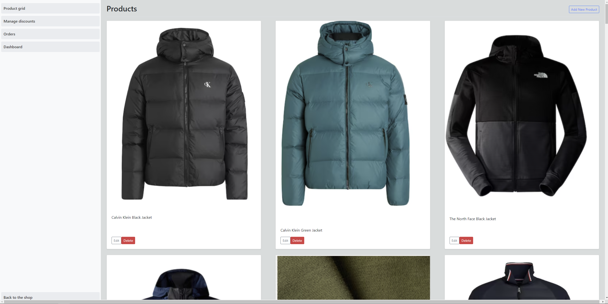

Once logged in as admin, you will have access to various administrative functions such as product management, discount management, order processing and viewing dashboard. In order to use these tools you have to navigate to the top menu bar on the homepage of the website. Then locate the button labeled "Admin" and click on it. Here is a visual representation where the button is located: 

It navigates you to this page`http://localhost:8080/admin/admin`:

The menu on the admin page provides a structured way to navigate through the administrative tasks related to managing an online store. Here is how it looks:

Here's a breakdown of what each option does:

1. **[Product Grid](tools/Product_Grid/Product_Management.md)**: This section is where you can view all the products currently listed in our online store. It is a visual layout where you can see product images along with their names. From here, you can perform actions like editing product details or deleting products that are no longer available.
    
2. **[Manage Discounts](tools/Discount/Discount.md)**: This option allows you to set up and manage discounts and promotional offers. It might let you specify the discount rate, duration, and which products or categories the discounts apply to. It's an essential feature for running sales and special promotions.
    
3. **[Orders](tools/Orders/Orders.md)**: Here, you can manage customer orders. This functionality typically includes viewing pending, processed, and completed orders, updating order statuses, and handling returns or exchanges. It's a critical part of the order fulfillment process.
    
4. **[Shop Income Summary](tools/Dashboard/Dashboard.md)**: 
    

The "Back to the shop" button at the bottom allows you to return to the customer view of the store, which is useful for checking the updates or changes you've made in the admin view.

