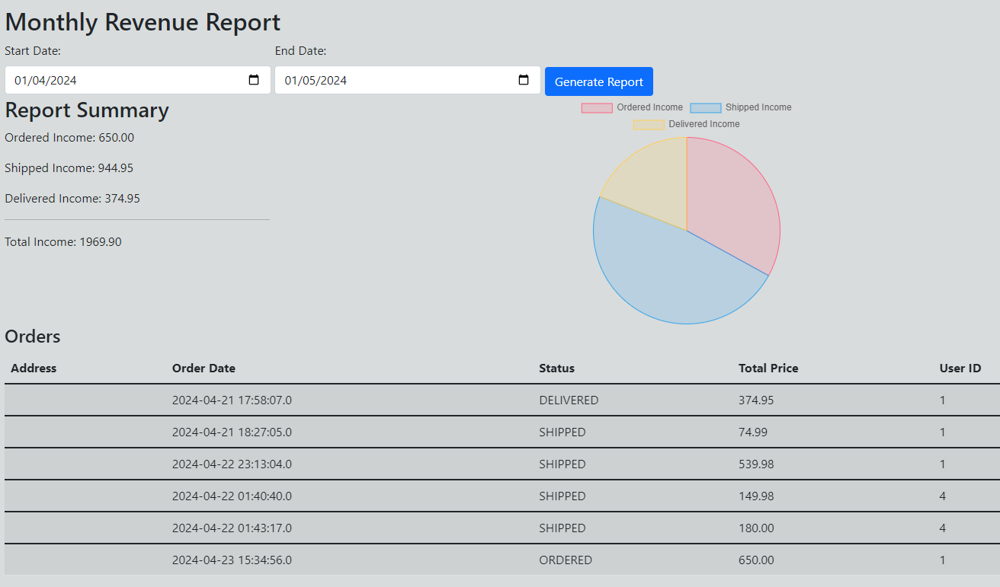

## Instructions for Report Generation
To generate a new report:
1. Set the desired **Start Date** and **End Date**.
2. Click the "Generate Report" button.

# Monthly Revenue Report
**Period**: April 1, 2024 - May 1, 2024

## Report Summary
The revenue is divided into three categories based on the order status:

- **Ordered Income**: $650.00
- **Shipped Income**: $944.95
- **Delivered Income**: $374.95

**Total Income for the Period**: $1969.90

The distribution of income is visualized in a pie chart with the following color coding:

- **Blue**: Ordered Income
- **Yellow**: Shipped Income
- **Pink**: Delivered Income

## Orders Detail
The following table summarizes the orders that contributed to the revenue:

| Order Date          | Status    | Total Price | User ID |
|---------------------|-----------|-------------|---------|
| 2024-04-21 17:58:07 | DELIVERED | $374.95     | 1       |
| 2024-04-21 18:27:05 | SHIPPED   | $74.99      | 1       |
| 2024-04-22 23:13:04 | SHIPPED   | $539.98     | 1       |
| 2024-04-22 01:40:40 | SHIPPED   | $149.98     | 4       |
| 2024-04-22 01:43:17 | SHIPPED   | $180.00     | 4       |
| 2024-04-23 15:34:56 | ORDERED   | $650.00     | 1       |

