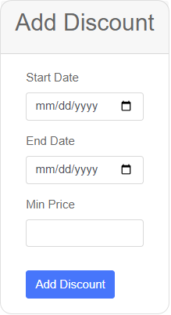

#AdminTool

## Add Discount 

On address `http://localhost:8080/admin/add-discount` you can add a discount.

When you open it in a browser it will show this page : 

### How to Add a Discount

To add a discount, follow these steps:

1. **Start Date**: Click on the "Start Date" field and select the date from the calendar when you want the discount to begin. The format for the date is mm/dd/yyyy.
    
2. **End Date**: Click on the "End Date" field to select the last date for the discount period. Ensure that the end date is after the start date.
    
3. **Minimum Price**: Enter the minimum price that a product must have for the discount to apply. This allows you to set discounts only on items above a certain price point.
    
4. Once all fields are completed, click on the "Add Discount" button to activate the discount. The system will automatically apply the discount to the products that meet the criteria set by the start date, end date, and minimum price.
