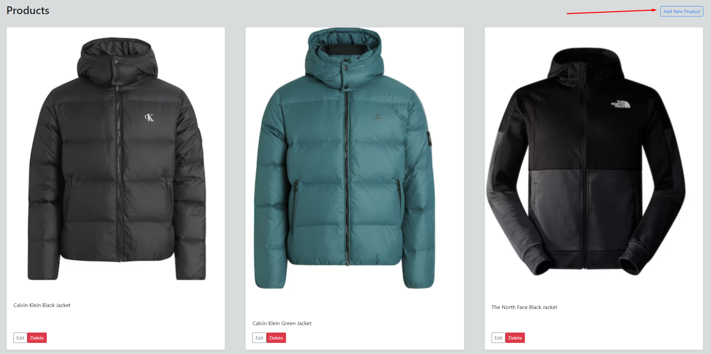
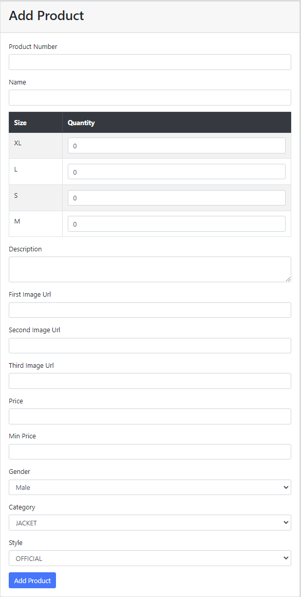
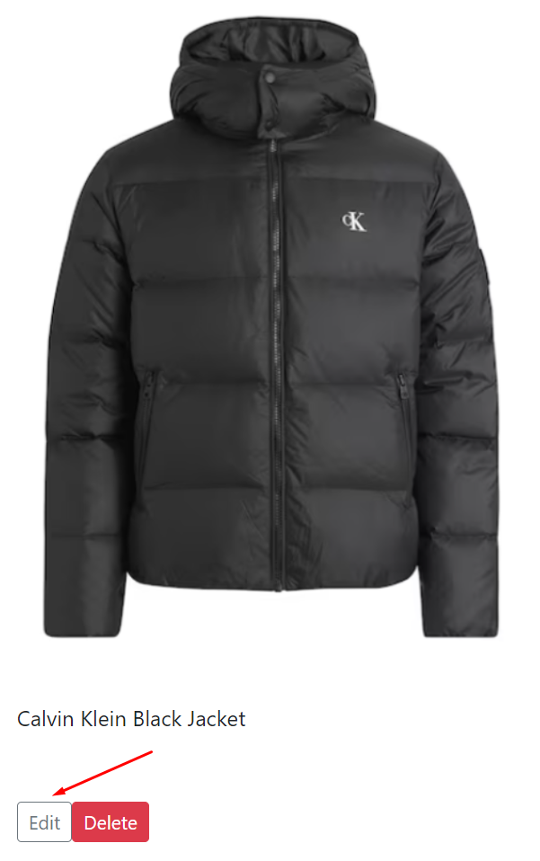
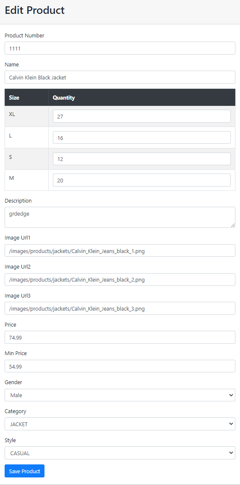
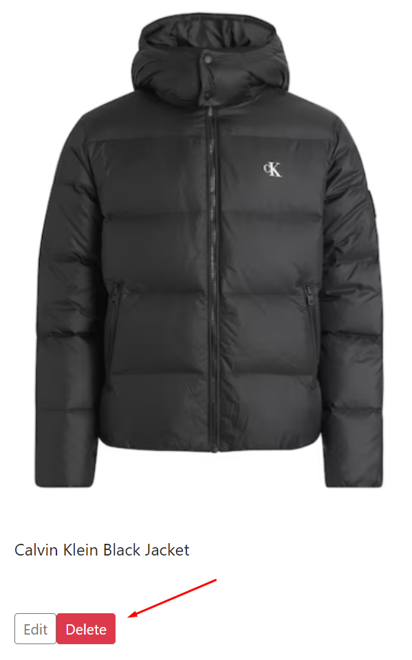

#AdminTool 

When you enter the product page on this address `http://localhost:8080/admin`, which is also the admin page, you can see all the products listed on the website. From here you can do three things -  add, edit or delete a product.

## Adding a New Product

To begin with, you can add a product when clicking on the button at the top right of the page. Here is a visual representation of where the button is: 

The add product page is located on this page `http://localhost:8080/admin/add-product`.

When you open it in a browser it will show this page :

### Steps to Add a New Product

1. **Product Number**: Enter a unique identifier for the product.
    
2. **Name**: Provide the name of the product as it will appear to customers on the website.
    
3. **Size and Quantity**: Enter the available sizes for the product (S, M, L, XL) and the quantity in stock for each size.
    
4. **Description**: Write a detailed description of the product, including material, care instructions, and any other relevant details.
    
5. **Image URLs**: Upload up to three images of the product by providing the URLs where the images are hosted. This will be the visual representation of your product on the site.
    
6. **Price**: Set the retail price for the product.
    
7. **Min Price**: Set the minimum price at which this product can be sold, which is used for price matching policies.
    
8. **Gender**: Select the gender that the product is targeted towards.
    
9. **Category**: Choose a category from the dropdown menu that best describes the type of clothing item you are adding (JACKET, SHIRT, T-SHIRT, JEANS).
    
10. **Style**: Select the style that best describes the product to help customers understand the design and fit (CASUAL, OFFICIAL, OVERSIZE).
    
11. After filling out all the fields, click the "Add Product" button to list the product on the website.

## Editing a Product

You can edit a product when clicking on the "Edit button" which is located in the same box as the item you want to change the information of. It look like this:

With the edit page you can modify the already existing products on the website. This page is located on this address `http://localhost:8080/admin/edit-product/product_id` and is the same as the add product page but with already filled information in the product information boxes.
It looks like this:

## Deleting a Product

You can delete a product from the "Delete button" which is located in the same box as the product you want to delete. It looks like this:

By just clicking on it, the product deletes itself from the database.

