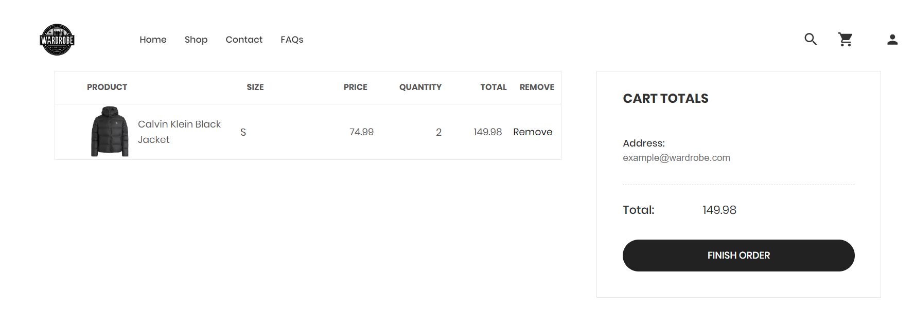
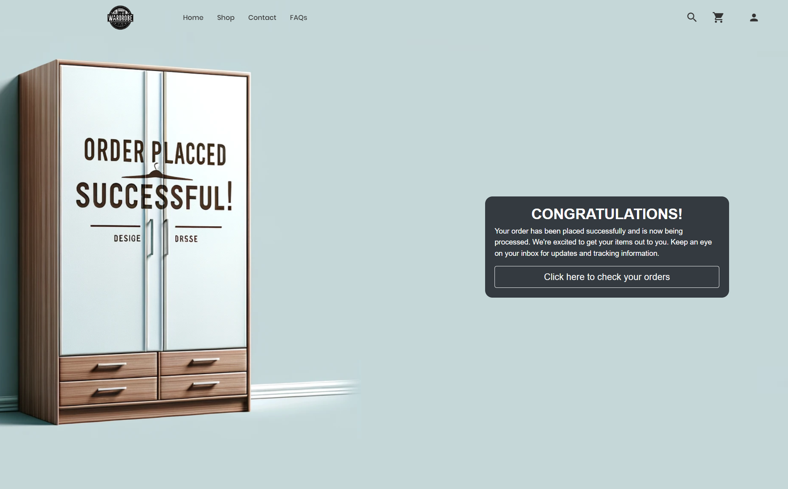

The cart page is where a customer can review the items they've selected before proceeding to checkout. This is the address `http://localhost:8080/shopping-cart` and this is how the page looks like:

Here's how it works:

1. **Product Details**: The page lists each item in your cart, showing a thumbnail image of the product, the product name, size selected, and the price per unit.
    
2. **Quantity**: Next to each product is the quantity box where you can see how many of that item you're planning to purchase.
    
3. **Total Price**: For each item, the total price is calculated based on the unit price and quantity. This gives you the subtotal for each type of item before any taxes or shipping costs are applied.
    
4. **Remove Option**: If you change your mind about an item, you can remove it from your cart by clicking the 'Remove' button.
    
5. **Cart Totals**: On the side of the page, there's a summary of your cart totals. This section adds up the total price of all items in your cart.
    
6. **Address**: Write the shipping address for your products.
    
7. **Finish Order/Checkout Button**: Once you've reviewed your items and are ready to purchase, you click the 'FINISH ORDER' button.

Then you are being lead to the page that tells you that your order was placed successfully. It is located on this address `http://localhost:8080/order-successful` and looks like that: 

From here you have the option to click and see all of your orders so you can track them whenever you want. 

