Firstly, as a user you can either register if you do not have a profile already created or you can just log into your profile in order to buy the clothes you've liked.

## How to Register

In order to register from the home page(`http://localhost:8080/index#`), click on the "Profile icon" located at the top right at the page and then click "Register" from the drop down menu. Here is how it looks like:

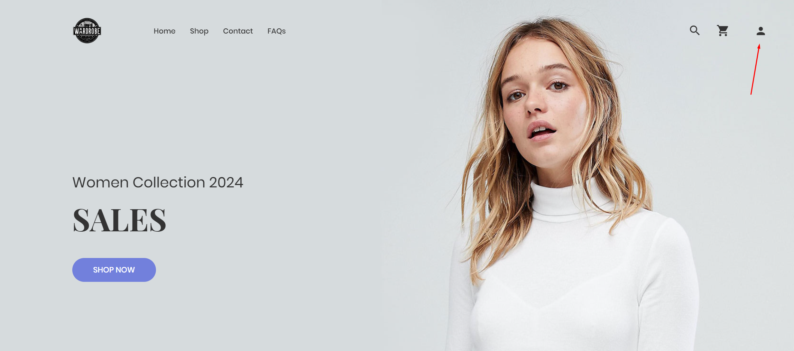

It leads you to this address `http://localhost:8080/users/register` and this page:

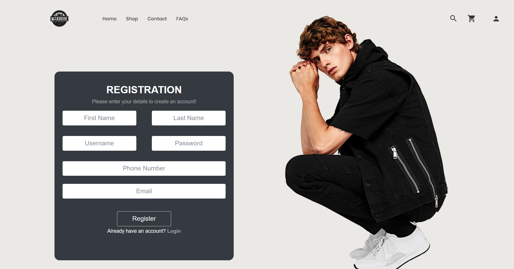

Here's how you can sign up:

1. **First Name**: Enter your given name as you would like it to appear on your account.
    
2. **Last Name**: Enter your family name.
    
3. **Username**: Choose a unique username that you will use to log in to your account.
    
4. **Password**: Create a strong password to secure your account.
    
5. **Phone Number**: Provide a valid phone number. This is needed for order confirmations or to recover your account.
    
6. **Email**: Enter your email address. It will be used for account verification, order receipts, and communication purposes.
    
7. Once all the information is filled out, click the "Register" button to complete the process.
    
8. If you already have an account, you can click on the "Login" link at the bottom of the form to redirect to the login page.

## How to Login

If you already have an account, you can go to the login page. You can do that by going again to the "Profile icon" at the top right of the home page and click "Login" from the drop down menu or from the registration page at the bottom of the fields. Here's again how it looks like from the main page:

It leads you to this address `http://localhost:8080/users/login` and this page:

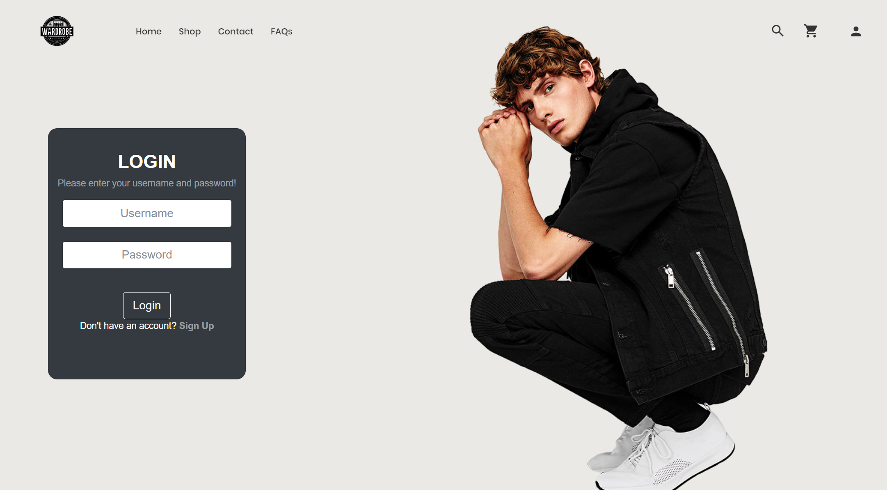

Here's how you can login:

1. **Username**: Enter your unique username in the field labeled 'Username'. This is the name you chose or were assigned when you registered on the website.
    
2. **Password**: Enter your password in the field labeled 'Password'. Remember that passwords are case-sensitive, so be sure to enter it exactly as you did when you created your account.
    
3. Click the 'Login' button to proceed. If your login credentials are correct, you will be taken to the main shopping page. 

## How to Change User Information

If you decide to change the information you've already given when you've registered, you can do that by going to the "Account page". It is located where the "Profile icon" is, at the top right of the page.

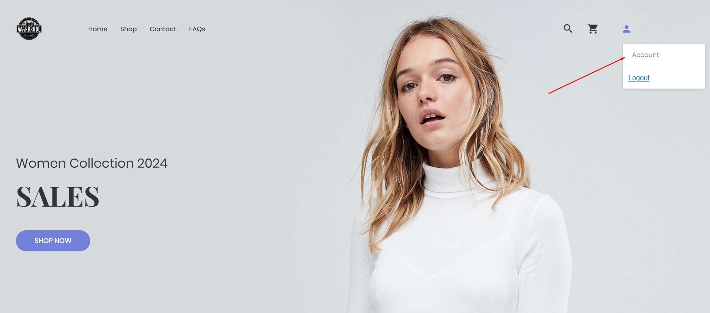

It leads you to this address `http://localhost:8080/users/account` and this page: 

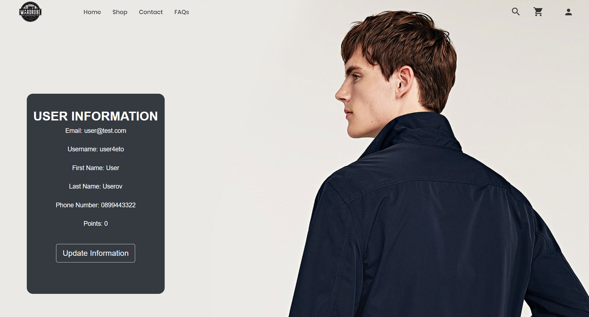

Here's how to change your information:

1. **Review Your Information**: On this page, you'll see your current account details displayed, such as your email, username, first and last name, phone number and points which decide what discount you can use on a product.
    
2. **Edit Information**: To update your information, click the "Update Information" button. This will take you to a separate page where you can enter new information. This is the address of the new page `http://localhost:8080/users/account-update/user_id`. It looks exactly like the account page but with editable fields.
    
3. **Make Changes**: After clicking "Update Information," you can modify any of the following details:
    
    - **Email**: Change your email if it's outdated or incorrect.
    - **First Name/Last Name**: Update these fields if there's a change or they were incorrectly entered initially.
    - **Phone Number**: Correct or update your contact number for order confirmations or customer service communications.
4. **Save Changes**: Once you've made the necessary updates click on "Update user information". Clicking this will apply the changes to your account.

## How to See And Buy Products

### How to See Products

In order to see all products, click on the "Shop page" button on the top navbar.

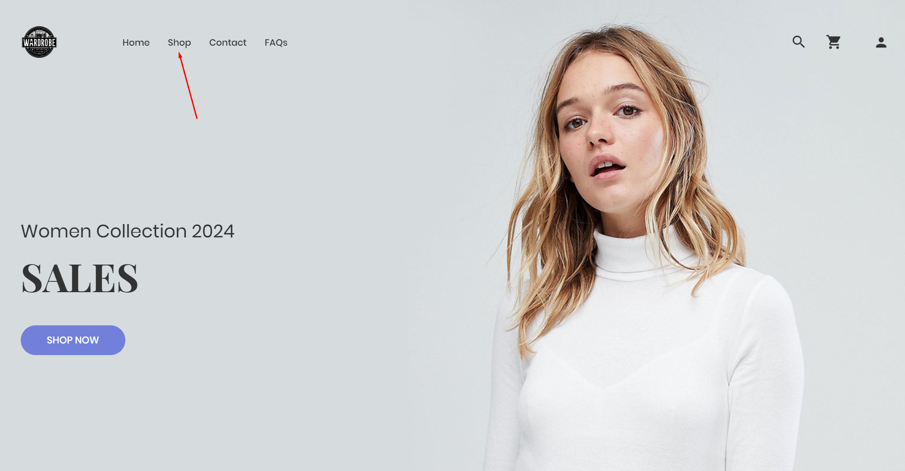

It leads you to `http://localhost:8080/shop` and this page:

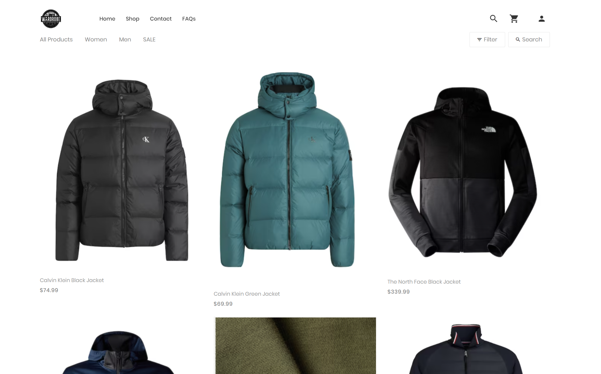

From here you can see all of the products but if you want to sort them by either only female clothes or male clothes you can click on the "Women" button or on the "Men" button at the top left on this page. You can also sort them by products that have a discount by clicking "SALE".
If you click the "Filter" button it shows up this:

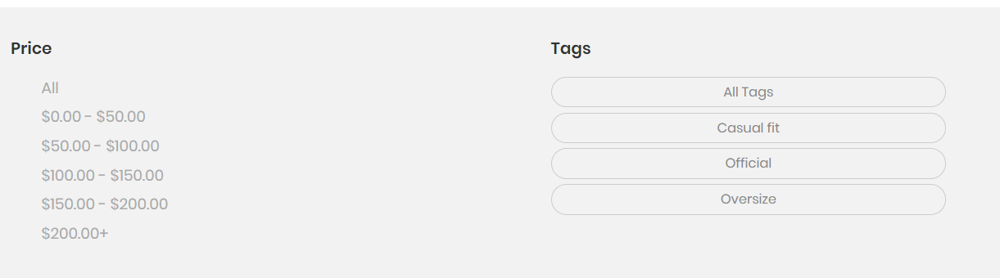

From here you can filter the products by price and style tags - Casual, Official, Oversize.

### How to Buy Products

When you've liked and selected a product you want to buy, click on it. It will lead you to the product page of the product (`http://localhost:8080/shop/product-detail/product_id`):

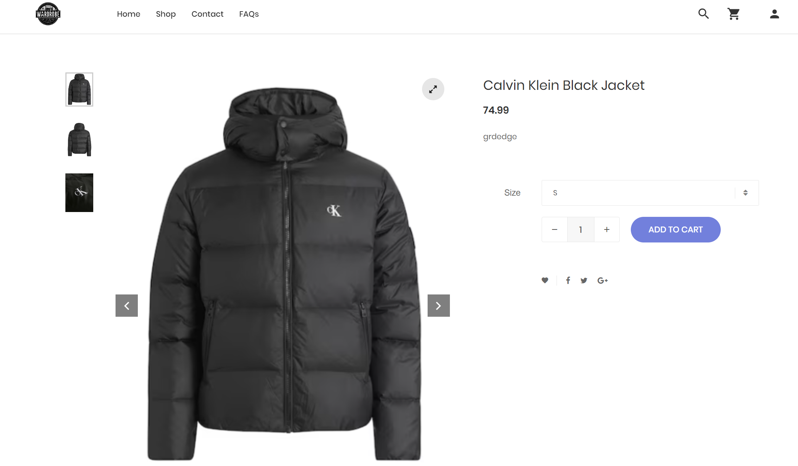

Here's how to navigate and use the product page:

1. **Product Images**: There should be a selection of images you can click on or scroll through to see the product from different angles. These images help you get a better idea of what the product looks like in reality.
    
2. **Product Description**: Below the price there's a description of the product.
    
3. **Size Selection**: A dropdown menu that allows you to select the size you need (S, M. L, XL).
    
4. **Quantity Selector**: You can usually choose how many of the item you'd like to order using a '+' to increase the quantity and a '-' to decrease it.
    
5. **Add to Cart**: Once you've selected the size and quantity, you can add the item to your shopping cart by clicking the "ADD TO CART" button. Then you must go to your [cart](Cart/Cart.md) if you are ready with your order.

## How to contact us

If you want to contact us you can click on the "Contact" button located at the navbar above. 

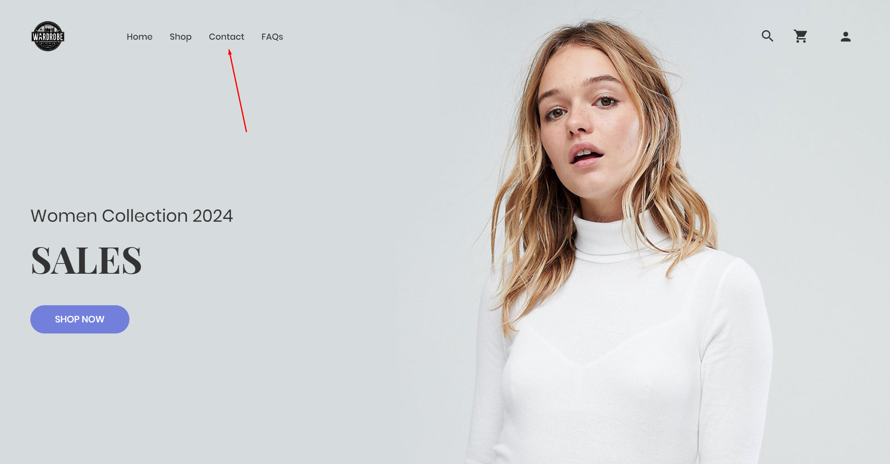

It leads you to this address `http://localhost:8080/contact` and this page:

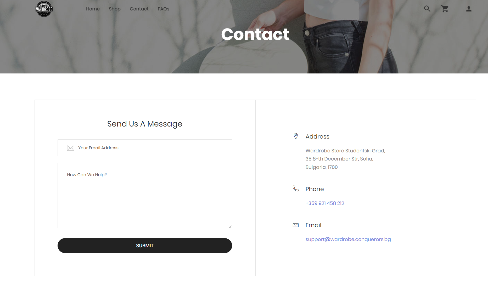

Here you can send us a message or you can call our phone number.

## Frequently Asked Questions

If you want to find the most common questions that customers may have, you will want to read the FAQs page. You can go there by clicking the "FAQs" button located at the navbar above.

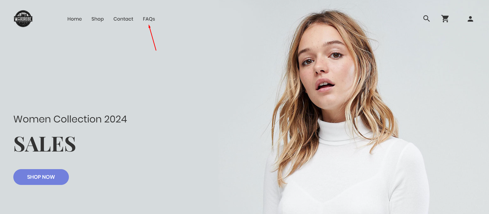

It leads you to this address `http://localhost:8080/faq` and this page:

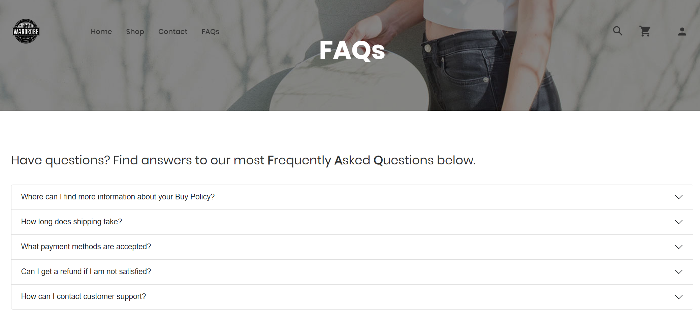

Here you can click on whatever question you may have or is related to in order to find an answer.

